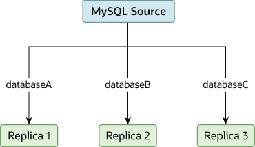

## WNN Replication Process
==========================================

## Description
  **MySQL** master-slave replication is a procedure that allows database files to be replicated or copied across one or more nodes in a network. This setup provides redundancy and fault tolerance such that in the event of a failure in the **Master node**, the databases can still be recovered in the **Slave node**. This gives users peace of mind that all will not be lost in any eventuality as a replica of the databases can still be retrieved from a different server.

  In this guide, you are going to learn how to perform a **MySQL or MariaDB** database Master-slave replication on an **Ubuntu Server Release 18.04 and Above**. Included are two files that will aid in the Installation process:

  + **Master_Setup** - A Step by step guide on Master Configuration.
  + **Slave_Setup** - A Step by step guide on Slave Configuration.


## Prerequisites
### Master and Slave Setup

**IP Addresses**
```
$ MASTER IP Address: 10.12.0.28
```
```
$ SLAVE IP Address: 10.12.0.29
```
```
$ mv .env.example .env
```
**Change configuration in .my.cnf and focus on adding the files below**
```
$ nano /etc/mysql/mysql.conf.d/mysqld.cnf or vim /etc/mysql/mysql.conf.d/mysqld.cnf
```
```
$ server-id
```
```
$ bind-address
```
```
$ 	log_bin = /var/log/mysql/mysql-bin.log
	log_bin_index =/var/log/mysql/mysql-bin.log.index
	relay_log = /var/log/mysql/mysql-relay-bin
	relay_log_index = /var/log/mysql/mysql-relay-bin.index
```
**Mysql or MariaDB**

```
$ sudo apt install mysql-server mysql-client
```
```
$ sudo systemctl restart mysql
```
```
$ sudo systemctl status mysql
```
**Replication User For Replication on Master Node**
```
$ Follow the guide on the Master_setup
```
**Checking Replication Status Master Node**
```
$ mysql> SHOW MASTER STATUS\G
```
**Checking Replication Status Slave Node**
```
$ mysql> SHOW SLAVE STATUS\G
```

## Screenshot

**Replicating Databases to Separate Replicas**


More Coming Soon
<!-- 


 -->


## Authors and acknowledgment
Show your appreciation to those who have contributed to the project.

## License
**WNN Creations**

Enjoy :)
